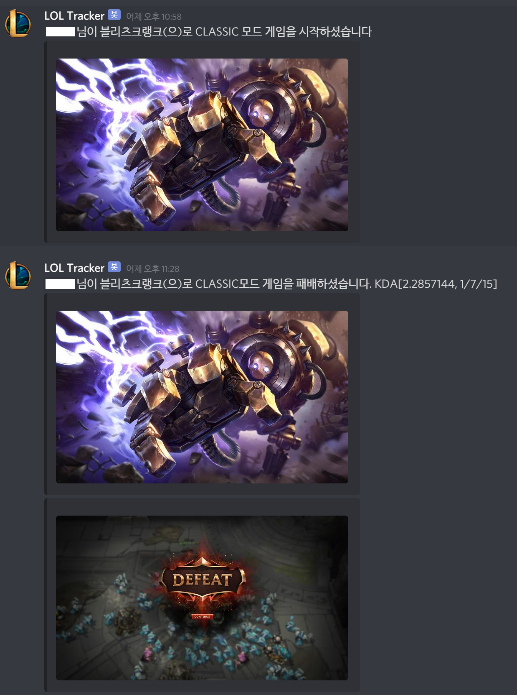

# lol-crawler

## 설명

C# .NET 5, ASP.NET CORE 3로 개발된 LOL Crawler 입니다.
현재는 등록된 유저를 추적해 Discord or Slack으로 WebHook을 날려서 알려주는 기능이 주요 기능입니다.

https://github.com/MingweiSamuel/Camille 프로젝트를 기반으로 많이 활용했습니다.

## 사용법

Cli 테스트시 `Config.json.sample` -> `Config.json` 으로 변경하시고 `라이엇 API Key`를 입력하셔야 합니다.

Server 가동시 `appsettings.Development.json`, `appsettings.Production.json` 파일을 sample 파일을 참고해서 생성하시고 RiotApiKey 부분에 `라이엇 API 키`를 입력하셔야 합니다.

또한 localhost에 mongodb를 구축하지 않으셨다면, `appsetting.[환경].json`에서 `ConnectionString` 부분을 수정하세요.

